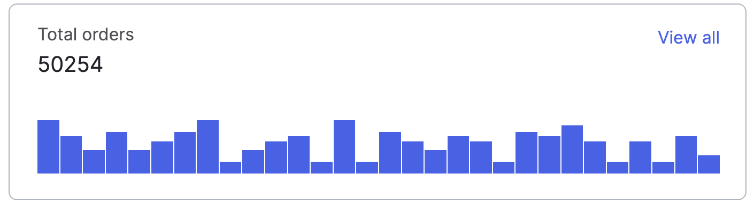

# DARYA KOLENCHENKO
## *future front-end developer*


## CONTACT ME
* Place: Warsaw, Poland
* Tel: +48 515 997 760
* E-mail: daria.kolenchenko@gmail.com
* Github: Dariechka
* Telegram: @darechkako

## ABOUT ME
I'm from Belarus, but now live in Poland. I have graduated Belarusian state university, chemistry department and have worked as scientist in Belarus academy of sciences, then as master-data specialist in international company Danone. I really like studying new things and achieving new skills.

## Skills and Proficiency
* HTML, CSS3
* JavaScript
* Git, GitHub
* VS Code
* SAP

## Code example
Write a function that returns the factorial of a given number.
```javascript
function factorial(n) {
      let result = 1;
      for (let i = n; i >= 1; i -= 1) {
          result = result * i;
      }
      return result;
  }
```

## Courses
* JavaScript Manual on [learn.javascript.ru](https://learn.javascript.ru/) (in progress)
* Course on modern CSS/HTML from [learn.javascript.ru](https://learn.javascript.ru/courses/htmlcss)
* Course "JavaScript/​DOM/​Interfaces" for beginners from [learn.javascript.ru](https://learn.javascript.ru/courses/jsbasic)

## Projects
[The library of components](https://github.com/Dariechka/htmlcss-20240412_daria-kolenchenko)


## Languages
* English - Intermediate
* Russian - Native
* Polish - Basic

[Link to my github](https://github.com/Dariechka)

## CREATED IN 2024

[Link to RS School](https://rs.school/)